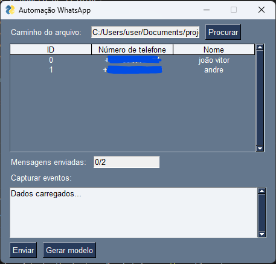

# Plataforma de Automação para Envio de Mensagens no WhatsApp

Esta plataforma permite a **automação do envio de mensagens** para o WhatsApp, facilitando o envio de **mensagens de texto**, **imagens** e **arquivos**. Para enviar outros tipos de arquivos, recomenda-se que sejam armazenados no Google Drive e inseridos como links na planilha de Excel.

## Estrutura da Planilha

A planilha deve conter as seguintes colunas:

- **telefone**: Número de celular no formato correto (incluindo o código do país).
- **nome**: Nome do contato
- **msg**: Primeira mensagem de texto a ser enviada.
- **img-1**: Caminho da imagem no seu computador.
- **img-msg-1**: Mensagem associada à imagem.
- **arq-1**: Link para o arquivo armazenado no Google Drive.
- **arq-msg-1**: Mensagem associada ao arquivo.

### Como Adicionar Mais Arquivos ou Imagens

Se você quiser adicionar mais arquivos ou imagens, basta usar a nomenclatura sequencial, como:

- **img-2, img-msg-2, arq-2, arq-msg-2**, e assim por diante.

## Exemplo de Preenchimento da Planilha

| telefone    | nome        | msg         | img-1                | img-msg-1       | arq-1                | arq-msg-1        |
|-------------|-------------|-------------|----------------------|-----------------|----------------------|------------------|
| 1234567890  | Pedrinho    | Olá!        | C:\img\imagem1.png   | Msmg da img1    | link google driver   | msg do arquivo 1 |

### Como Funciona

1. **telefone**: Informe o número de celular.
2. **nome**: Nome do contato.
3. **msg**: A primeira mensagem de texto a ser enviada.
4. **img-1**: Informe o caminho da imagem local para enviar.
5. **img-msg-1**: Escreva a mensagem que acompanha a imagem.
6. **arq-1**: Coloque o link do arquivo hospedado no Google Drive.
7. **arq-msg-1**: Escreva a mensagem que acompanha o arquivo.

### Imagem da Plataforma

Esta é uma visão geral da plataforma, mostrando como você pode automatizar o envio de mensagens de forma rápida e eficiente.

